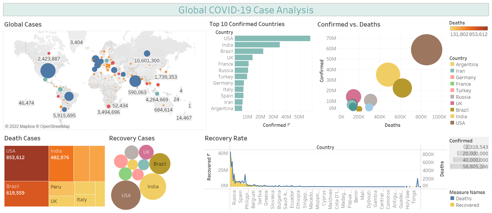

# COVID-19-Analysis
Utilized Tableau visualization and the Python Data Stack and to conduct data analysis for a COVID-19 dataset in the Pandas and Matplotlib libraries. This analysis considers the correlations between population and geography, and their effects on patient case status, recovery rates, and mortality rate in India and across the globe. Please view the accompanied Tableau file to view the summarized dashboard of the visualization. 

